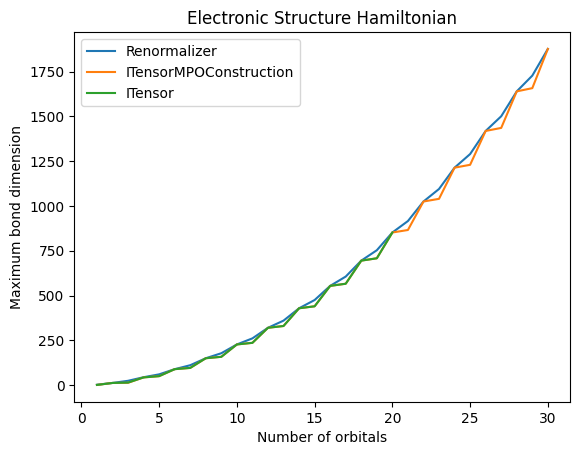

# ITensorMPOConstruction

[](https://ITensor.github.io/ITensorMPOConstruction.jl/stable/)
[](https://ITensor.github.io/ITensorMPOConstruction.jl/dev/)
[](https://github.com/ITensor/ITensorMPOConstruction.jl/actions/workflows/CI.yml?query=branch%3Amain)
[](https://codecov.io/gh/ITensor/ITensorMPOConstruction.jl)
[](https://github.com/invenia/BlueStyle)

A fast algorithm for constructing a Matrix Product Operator (MPO) from a sum of local operators. This is a replacement for `MPO(os::OpSum, sites::Vector{<:Index})`. In all cases examined so far this algorithm constructs an MPO with a smaller (or equal) bond dimension faster than the competition. All runtimes below are taken from a single sample on a 2021 MacBook Pro with the M1 Max CPU and 32GB of memory.

## Installation

The package is currently not registered. Please install with the commands:
```julia
julia> using Pkg; Pkg.add(url="https://github.com/ITensor/ITensorMPOConstruction.jl.git")
```

## Constraints

This algorithm shares the same constraints as ITensors' default algorithm.

1. The operator must be expressed as a sum of products of single site operators. For example a CNOT could not appear in the sum since it is a two site operator.
2. When dealing with Fermionic systems the parity of each term in the sum must be even. That is the combined number of creation and annihilation operators in each term in the sum must be even.

There are also two additional constraints:

3. Each term in the sum of products representation can only have a single operator acting on a site. For example a term such as $\mathbf{X}^{(1)} \mathbf{X}^{(1)}$ is not allowed. However, there is a pre-processing utility that can automatically replace $\mathbf{X}^{(1)} \mathbf{X}^{(1)}$ with $\mathbf{I}^{(1)}$. This is not a hard requirement for the algorithm but a simplification to improve performance.
4. When constructing a quantum number conserving operator the total flux of the operator must be zero. It would be trivial to remove this constraint.

## `MPO_new`

The main exported function is `MPO_new` which takes an `OpSum` and transforms it into a MPO.

```julia
function MPO_new(os::OpSum, sites::Vector{<:Index}; kwargs...)::MPO
```

The optional keyword arguments are
* `basis_op_cache_vec`: A list of operators to use as a basis for each site. The operators on each site are expressed as one of these basis operators.
* `tol::Real`: The tolerance used in the sparse QR decomposition (which is done by SPQR). The default value is the SPQR default which is calculated separately for each QR decomposition. If you want a MPO that is accurate up to floating point errors the default tolerance should work well. If instead you  want to compress the MPO the value `tol` will differ from the `cutoff` passed to `ITensor.MPO` since the truncation method is completely different. If you want to replicate the same truncation behavior first construct the MPO with a suitably small (or default) `tol` and then use `ITensors.truncate!`.

## Examples: Fermi-Hubbard Hamiltonian in Real Space

The one dimensional Fermi-Hubbard Hamiltonian with periodic boundary conditions on $N$ sites can be expressed in real space as

$$
\mathcal{H} = -t \sum_{i = 1}^N \sum_{\sigma \in (\uparrow, \downarrow)} \left( c^\dagger_{i, \sigma} c_{i + 1, \sigma} + c^\dagger_{i, \sigma} c_{i - 1, \sigma} \right) + U \sum_{i = 1}^N n_{i, \uparrow} n_{i, \downarrow} \ ,
$$

where the periodic boundary conditions enforce that $c_k = c_{k + N}$. For this Hamiltonian all that needs to be done to switch over to using ITensorMPOConstruction is switch `MPO(os, sites)` to `MPO_New(os, sites)`.

https://github.com/ITensor/ITensorMPOConstruction.jl/blob/637dd2409f27ede41aa916822ea8acb4cd557a9e/examples/fermi-hubbard.jl#L4-L24

For $N = 1000$ both ITensors and ITensorMPOConstruction can construct an MPO of bond dimension 10 in under two seconds. For a compelling reason to use ITensorMPOConstruction we need to look at a more complicated Hamiltonian.

## Examples: Fermi-Hubbard Hamiltonian in Momentum Space

The one dimensional Fermi-Hubbard Hamiltonian with periodic boundary conditions on $N$ sites can be expressed in momentum space as

$$
\mathcal{H} = \sum_{k = 1}^N \epsilon(k) \left( n_{k, \downarrow} + n_{k, \uparrow} \right) + \frac{U}{N} \sum_{p, q, k = 1}^N c^\dagger_{p - k, \uparrow} c^\dagger_{q + k, \downarrow} c_{q, \downarrow} c_{p, \uparrow}
$$

where $\epsilon(k) = -2 t \cos(\frac{2 \pi k}{N})$ and $c_k = c_{k + N}$. The code to construct the `OpSum` is shown below.

https://github.com/ITensor/ITensorMPOConstruction.jl/blob/637dd2409f27ede41aa916822ea8acb4cd557a9e/examples/fermi-hubbard.jl#L26-L49

Unlike the previous example, some more involved changes will be required to use ITensorMPOConstruction. This is because the `OpSum` has multiple operators acting on the same site, violating constraint #3. For example when $k = 0$ in the second loop we have terms of the form $c^\dagger_{p, \uparrow} c^\dagger_{q, \downarrow} c_{q, \downarrow} c_{p, \uparrow}$. You could always create a special case for $k = 0$ and rewrite it as $n_{p, \uparrow} n_{q, \downarrow}$. However if using "Electron" sites then you would also need to consider other cases such as when $p = q$, this would introduce a lot of extraneous complication. Luckily ITensorMPOConstruction provides a method to automatically perform these transformations. If you provide a set of operators for each site to `MPO_new` it will attempt to express the operators acting on each site as a single one of these "basis" operators. The code to do this is shown below.

https://github.com/ITensor/ITensorMPOConstruction.jl/blob/637dd2409f27ede41aa916822ea8acb4cd557a9e/examples/fermi-hubbard.jl#L51-L76

### `OpIDSum`

For $N = 200$ constructing the `OpSum` takes 42s and constructing the MPO from the `OpSum` with ITensorMPOConstruction takes another 306s. For some systems constructing the `OpSum` can actually be the bottleneck. In these cases you can construct an `OpIDSum` instead.

`OpIDSum` plays the same roll as `OpSum` but in a much more efficient manner. To specify an operator in a term of an `OpSum` you specify a string (the operator's name) and a site index, whereas to specify an operator in a term of an `OpIDSum` you specify an `OpID` which contains an operator index and a site. The operator index is the index of the operator in the provided basis for the site.

For $N = 200$ constructing an `OpIDSum` takes only 0.4s. Shown below is code to construct the Hamiltonian using an `OpIDSum`.

https://github.com/ITensor/ITensorMPOConstruction.jl/blob/637dd2409f27ede41aa916822ea8acb4cd557a9e/examples/fermi-hubbard.jl#L79-L130

## Benchmarks: Fermi-Hubbard Hamiltonian in Momentum Space

Below is a plot of the bond dimension of the MPO produced by ITensors' default algorithm, [Renormalizer](https://github.com/shuaigroup/Renormalizer) which uses the [bipartite-graph algorithm](https://doi.org/10.1063/5.0018149), and ITensorMPOConstruction.


Of note is that the bond dimension of the MPO produced by Renormalizer scales as $O(N^2)$, both ITensors and ITensorMPOConstruction however produce an MPO with a bond dimension that scales as $O(N)$. 

Below is a table of the time it took to construct the MPO (including the time it took to specify the Hamiltonian) for various number of sites. For ITensorMPOConstruction an `OpIDSum` was used. Some warm up was done for the Julia calculations to avoid measuring compilation overhead.

| $N$ | ITensors | Renormalizer | ITensorMPOConstruction |
|-----|----------|--------------|------------------------|
| 10  | 0.35s    | 0.26         | 0.04s                  |
| 20  | 27s      | 3.4s         | 0.10s                  |
| 30  | N/A      | 17s          | 0.24s                  |
| 40  | N/A      | 59s          | 0.59s                  |
| 50  | N/A      | 244s         | 1.2s                   |
| 100 | N/A      | N/A          | 16s                    |
| 200 | N/A      | N/A          | 283s                   |

## Benchmarks: Electronic Structure Hamiltonian

After looking at the previous example you might assume that the relative speed of ITensorMPOConstruction over Renormalizer might be due to the fact that for the Fermi-Hubbard Hamiltonian ITensorMPOConstruction is able to construct a more compact MPO. In the case of the electronic structure Hamiltonian all algorithms produce MPOs of similar bond dimensions.



However, ITensorMPOConstruction is still an order of magnitude faster than Renormalizer. The code for this example can be found in [examples/electronic-structure.jl](https://github.com/ITensor/ITensorMPOConstruction.jl/blob/main/examples/electronic-structure.jl). The run time to generate these MPOs (including the time it took to specify the Hamiltonian) are shown below. For ITensorMPOConstruction an `OpIDSum` was used.

| $N$ | ITensors | Renormalizer | ITensorMPOConstruction |
|-----|----------|--------------|------------------------|
| 10  | 3.0s     | 2.1s         | 0.31s                  |
| 20  | 498s     | 61s          | 5.9s                   |
| 30  | N/A      | 458s         | 36s                    |
| 40  | N/A      | 2250s        | 162s                   |
| 50  | N/A      | N/A          | 504s                   |
| 60  | N/A      | N/A          | 1323s                  |
