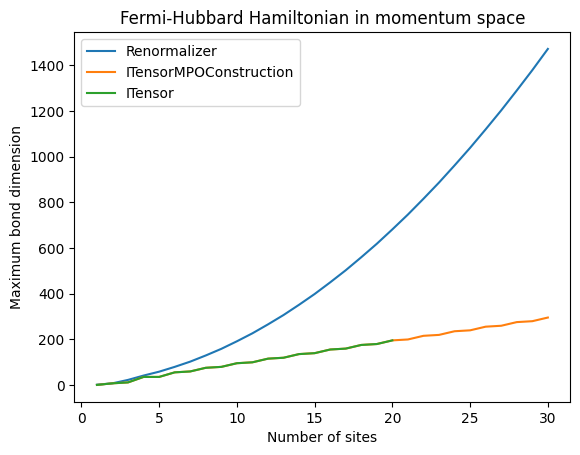

# ITensorMPOConstruction

[](https://ITensor.github.io/ITensorMPOConstruction.jl/stable/)
[](https://ITensor.github.io/ITensorMPOConstruction.jl/dev/)
[](https://github.com/ITensor/ITensorMPOConstruction.jl/actions/workflows/CI.yml?query=branch%3Amain)
[](https://codecov.io/gh/ITensor/ITensorMPOConstruction.jl)
[](https://github.com/invenia/BlueStyle)

A fast algorithm for constructing a Matrix Product Operator (MPO) from a sum of local operators. This is a replacement for `MPO(os::OpSum, sites::Vector{<:Index})`. In all cases examined so far this algorithm constructs an MPO with a smaller (or equal) bond dimension faster than the competition.

## Installation

The package is currently not registered. Please install with the commands:
```julia
julia> using Pkg; Pkg.add(url="https://github.com/ITensor/ITensorMPOConstruction.jl.git")
```

## Constraints

This algorithm shares same constraints as ITensor's default algorithm.

* The operator must be expressed as a sum of products of single site operators. For example a CNOT could not appear in the sum since it is a two site operator.
* When dealing with Fermionic systems the parity of each term in the sum must be even. That is the combined number of creation and annihilation operators must be even.

There are also two additional constraints:

* Each term in the sum of products representation can only have a single operator acting on a site. For example a term such as $\mathbf{X}^{(1)} \mathbf{X}^{(1)}$ is not allowed. However, there is a pre-processing utility that can automatically replace $\mathbf{X}^{(1)} \mathbf{X}^{(1)}$ with $\mathbf{I}^{(1)}$. This is not a hard requirement for the algorithm, just a simplification to improve performance. Many operators of interest can be easily expressed in a form where only a single operator acts on each site in a term. 
* When constructing a quantum number (QN) conserving operator the total flux of the operator must be zero. It would be trivial to remove this constraint.

## `MPO_new`

The main exported function is `MPO_new` which takes an `OpSum` and transforms it into a MPO.

```julia
function MPO_new(os::OpSum, sites::Vector{<:Index}; kwargs...)::MPO
```

The optional keyword arguments are
* `tol::Real`: The tolerance used in the sparse QR decomposition. The default value is calculated separately for each QR decomposition, it is almost always a good value.
* `basisOpCacheVec::OpCacheVec`: A list of operators to use as a basis for each site. The operators on at each site are expressed as one of these basis operators.

## Examples: Fermi-Hubbard Hamiltonian in Momentum Space

The one dimensional Fermi-Hubbard Hamiltonian with periodic boundary conditions on $N$ sites can be expressed in momentum space as

$$
\mathcal{H} = \sum_{k = 1}^N \epsilon(k) \left( n_{k, \downarrow} + n_{k, \uparrow} \right) + \frac{U}{N} \sum_{p, q, k = 1}^N c^\dagger_{p - k, \uparrow} c^\dagger_{q + k, \downarrow} c_{q, \downarrow} c_{p, \uparrow}
$$

where $\epsilon(k) = -2 t \cos(\frac{2 \pi k}{N})$ and $c_k = c_{k + N}$. Below is a plot of the bond dimension of the MPO produced by ITensors' default algorithm, [Renormalizer](https://github.com/shuaigroup/Renormalizer) which uses the [bipartite-graph algorithm](https://doi.org/10.1063/5.0018149), and `ITensorMPOConstruction`.



Of note is that the bond dimension of the MPO produced by Renormalizer scales as $O(N^2)$, both ITensors and ITensorMPOConstruction however produce an MPO with a bond dimension that scales as $O(N)$. Below is a table of the time it took to construct the MPO for various number of sites. Some warm up was done for the Julia calculations to avoid measuring compilation overhead. Data recorded on 2021 MacBook Pro with the M1 Max CPU and 32GB of memory.

| $N$ | ITensors | Renormalizer | ITensorMPOConstruction |
|-----|----------|--------------|------------------------|
| 10  | 0.35s    | 0.26         | 0.03s                  |
| 20  | 27s      | 3.4s         | 0.15s                  |
| 30  | N/A      | 17s          | 0.41s                  |
| 40  | N/A      | 59s          | 0.93s                  |
| 50  | N/A      | 244s         | 1.8s                   |
| 100 | N/A      | N/A          | 20s                    |
| 200 | N/A      | N/A          | 310s                   |


The code for this example can be found in [examples/fermi-hubbard.jl](https://github.com/ITensor/ITensorMPOConstruction.jl/blob/main/examples/fermi-hubbard.jl). Just like with ITensors, the terms in the Hamiltonian are put into an `OpSum` and then the `OpSum` is transformed into an `MPO`. The code to produce the `OpSum` is

```julia
os = OpSum{Float64}()
for k in 1:N
  epsilon = -2 * t * cospi(2 * k / N)
  os .+= epsilon, "Nup", k
  os .+= epsilon, "Ndn", k
end

for p in 1:N
  for q in 1:N
    for k in 1:N
      os .+= U / N, "Cdagup", mod1(p - k, N), "Cdagdn", mod1(q + k, N), "Cdn", q, "Cup", p
    end
  end
end
```

The astute reader will notice that this `OpSum` has multiple operators acting on the same site. For example, it contains the term `"Cdagup", 1, "Cdagdn", 1, "Cdn", 1, "Cup", 1`. If we try and pass this `OpSum` to `MPO_New` directly it will throw an error. However, `"Cdagup", 1, "Cdagdn", 1, "Cdn", 1, "Cup", 1` is equivalent to `"Nup * Ndn", 1` and by passing a set of basis operators to `MPO_New` we can automatically convert any product of operators acting on a single site into one of these single basis operators. This is accomplished by the following

```julia
sites = siteinds("Electron", N; conserve_qns=true)

operatorNames = [
  "I",
  "Cdn",
  "Cup",
  "Cdagdn",
  "Cdagup",
  "Ndn",
  "Nup",
  "Cup * Cdn",
  "Cup * Cdagdn",
  "Cup * Ndn",
  "Cdagup * Cdn",
  "Cdagup * Cdagdn",
  "Cdagup * Ndn",
  "Nup * Cdn",
  "Nup * Cdagdn",
  "Nup * Ndn",
]

opCacheVec = [
  [OpInfo(ITensors.Op(name, n), sites[n]) for name in operatorNames] for
  n in eachindex(sites)
]

return MPO_new(os, sites; basisOpCacheVec=opCacheVec)
```
